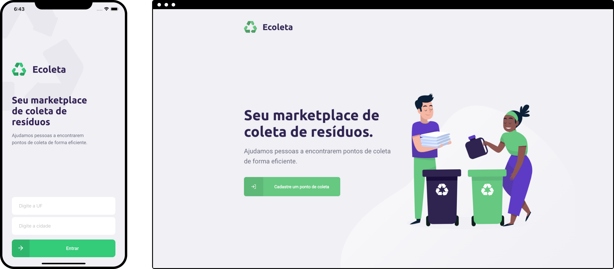

<h1 align="center">
    
</h1>

<h4 align="center">
  Recycle! Do your part!
</h4>

<br>

<p align="center">
  
</p>

## :rocket: Technologies

This project was developed with the following technologies:

- [Node.js](https://nodejs.org/en/)
- [React](https://reactjs.org)
- [React Native](https://facebook.github.io/react-native/) with [Expo](https://expo.io/)

## 💻 Project

Ecoleta is a project to help people find recycling collection points.

## 🤔 How to contribute

- Make a fork;
- Create a branck with your feature: git checkout -b my-feature;
- Commit changes: git commit -m 'feat: My new feature';
- Make a push to your branch: git push origin my-feature.

## 🔥 How to install

```bash
# clone this repo

# to run the api
$ cd backend
$ yarn
$ yarn knex migrate:latest
$ yarn knex seed:run
$ yarn start

# to run frontend
$ cd frontend
$ yarn
$ yarn start

# to run mobile
$ cd mobile
$ yarn
$ expo start
```

## :memo: License

This project is under the MIT license. See the [LICENSE](LICENSE.md) for details.

Lucas Moreira :wave: [Get in touch!](https://www.linkedin.com/in/lucas-moreira/)
